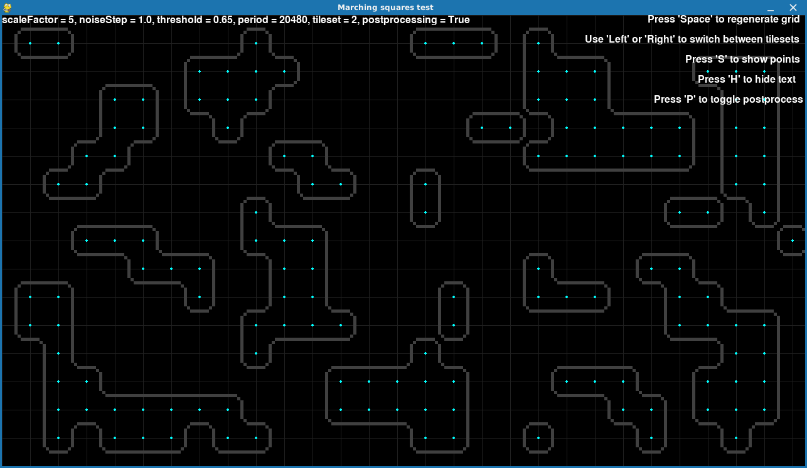

Simple demo of marching squares algorithm.

```
usage: main.py [-h] [--scale SCALE] [--step STEP] [--threshold THRESHOLD] [--period PERIOD] [--pp]

options:
  -h, --help            show this help message and exit
  --scale SCALE         Scale factor. Default: 3
  --step STEP           Noise step. Default: 1.0
  --threshold THRESHOLD
                        Points threshold. Default: 0.5
  --period PERIOD       Noise period. Default: (screen.w * screen.h) // cellSize
  --pp                  Try to remove islands by doing some postprocessing. Default: no
```


